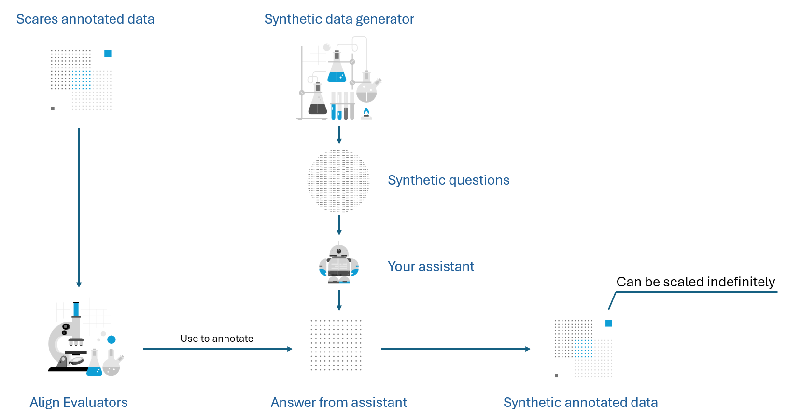
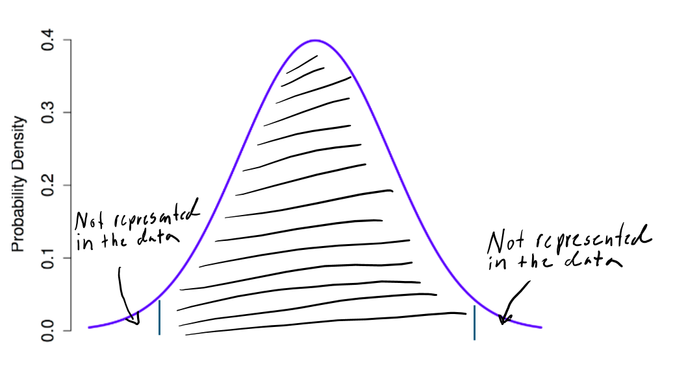
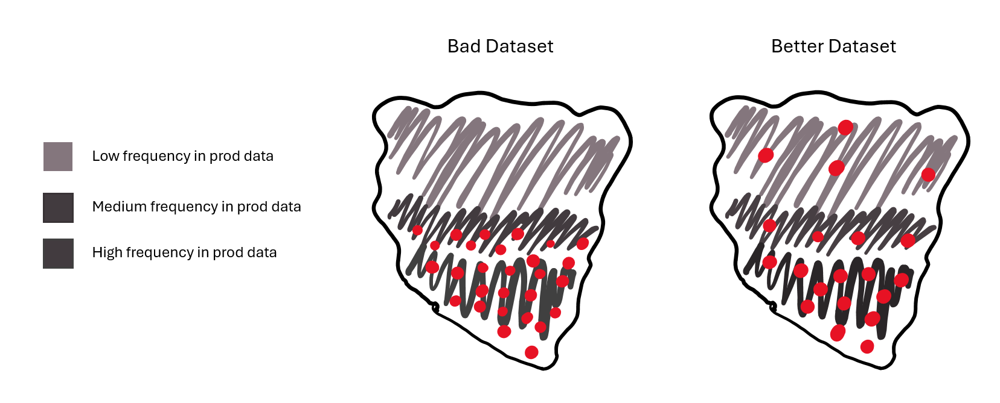

# AI Assistant Alignment & Evaluation

Welcome to the AI Assistant Alignment & Evaluation repository. It is a "bring your own assistant" framework: you plug in your own search/retrieval stack and answer generation (chatbot) implementation, and use the provided methodology (synthetic data + automatic evaluators) to iteratively align and measure quality. The methodology and example narrative are fictional; adapt freely to your production scenario.



# Chat Evaluation Repository (Implementation Details)

This codebase contains a concrete implementation of the above concepts with two main components: **Synthetic Data Generation** and **Evaluation Pipeline** enabling automated testing and quality assessment of chat responses through synthetic Q&A pairs and multi-metric evaluation.

## 📁 Repository Structure

```
chat-evaluation/
├── README.md
├── data/
│   ├── eval_results/          # Evaluation results from pipeline runs
│   ├── q-a/                   # Generated question-answer pairs
│   ├── q-a-vetted/           # Manually reviewed and approved Q&A pairs
│   └── chatbot-answers/      # Responses from the chatbot
├── synthetic_data_generation/ # Synthetic Q&A generation system
└── evals/                    # Evaluation pipeline and metrics
```

## 🚀 Quick Start

### Prerequisites

- Python 3.8+
- Azure OpenAI access
- Azure AI Search service
- Chatbot API access

### 0. Implement Pluggable Components (REQUIRED)

Before running any of the commands below you MUST wire up your own search + answer generation logic; otherwise subsequent steps will either return empty context or produce meaningless evaluations.

Implement these two files first:

1. `synthetic_data_generation/search/search_service.py`
   - Add your retrieval / search call (Azure AI Search, custom, etc.).
   - Map your index field names and return a normalized list of docs like `{ "id": str, "content": str, "source": str, "metadata": {...} }`.
2. `evals/answer_generation/answer_generator.py`
   - Call your chatbot / model endpoint for each question.
   - Return at least an `answer` string (optionally citations, raw payload, latency, etc.).

Quick smoke test before proceeding:
 - `python -c "from synthetic_data_generation.search.search_service import SearchService; print(SearchService().search('test'))"` returns docs
 - `python -c "from evals.answer_generation.answer_generator import AnswerGenerator; print(AnswerGenerator().generate_answer('Test question')['answer'])"` returns a non-empty answer

If those work, continue with Step 1.

### 1. Generate Synthetic Data

```bash
cd synthetic_data_generation
pip install -r requirements.txt
python main.py
```

### 2. Manual Vetting (Recommended)

Launch the annotation tool to manually review generated Q&A pairs:

```bash
cd synthetic_data_generation
streamlit run qa_annotator_app.py
```

### 3. Run Evaluation Pipeline

```bash
cd evals
pip install -r requirements.txt
python evaluation_pipeline.py
```

## � Solution Overview

Two pillars underpin effective alignment:
1. Synthetic Data Generation (broad & diverse sampling of potential user queries)
2. Automatic Evaluators (scalable, repeatable measurement loop)

Teams often underutilize both because of perceived complexity or unclear ROI. This framework operationalizes them so you can focus on refining model behavior.

## 🧰 Key Technologies

- Azure OpenAI (chat, embeddings, optional evaluation models) – can be substituted with OpenAI / other providers.
- Azure AI Evaluation SDK (orchestrates multi-metric runs; local or scaled execution).
- Retrieval / Search (Azure AI Search or custom) – pluggable via `search_service.py`.

## 🧪 Importance of Synthetic Data

High-quality alignment requires breadth and depth. Human-crafted test sets typically cluster around common phrasings and miss edge cases. Synthetic generation lets you:
- Expand coverage (rare intents, long-tail phrasings, adversarial variants)
- Reduce SME hours spent crafting examples
- Quantify improvements statistically (enough samples for meaningful deltas)

### Sufficient Data Quantity
Models are sensitive to small prompt/config changes. To assert improvements with confidence, you need enough independent samples across the operational distribution.

### Out-of-Distribution Behaviour
Real traffic contains tail patterns absent from naive samples. Synthetic generation purposefully explores those tails.



Broader sampling reduces surprise failure modes in production.



## 🤖 Importance of Automatic Evaluators

### Iterative Alignment
Fast model/prompt iteration demands near-immediate feedback. Automatic evaluators replace most day-to-day SME review with machine judgments plus targeted spot checks.

### Scaling Evaluation
Manual-only evaluation does not scale with dataset size. Automated metrics (correctness, citation quality, completeness, etc.) allow continuous regression detection and trend tracking.

## �🔧 Components

### Synthetic Data Generation

The synthetic data generation system creates diverse, question-answer pairs for evaluation purposes.

**Why Synthetic Data?**
- **SME Efficiency**: Reduces the time Subject Matter Experts spend creating test cases
- **Comprehensive Coverage**: Generates questions covering edge cases and scenarios humans might miss
- **Scale**: Creates large datasets needed for robust evaluation
- **Diversity**: Ensures representation across different question types, complexity levels, and domains

**Components:**
- `generators/` - Question generation algorithms
- `diversity/` - Diversity optimization
- `qa_factory/` - Orchestration and quality control
- `search/` - Integration to the knowlege base of the chatbot
- `qa_annotator_app.py` - Manual vetting interface

### Evaluation Pipeline

The evaluation system assesses chatbot responses using multiple Azure AI metrics and custom evaluators.

**Key Features:**
- **Multi-metric evaluation**: Evaluate the answers based on several metrics
- **Automated pipeline**: End-to-end evaluation workflow
- **Visual reporting**: Charts and dashboards for result analysis

**Components:**
- `answer_generation/` - Chatbot response collection
- `evaluation/` - Azure AI evaluation metrics
- `visualizer/` - Result visualization and reporting

## 📊 Workflow

### Primary Evaluation Workflow

The intended workflow follows this sequence:

```
Synthetic Data Generation → Vetting → Run Evals → Iterate → Run Evals → ...
```

**Step-by-Step Process:**

1. **Generate Synthetic Data**
   ```bash
   python synthetic_data_generation/main.py
   ```
   Creates initial Q&A pairs for evaluation

2. **Manual Vetting** (Recommended for Quality)
   ```bash
   streamlit run qa_annotator_app.py
   ```
   - Review generated Q&A pairs
   - Approve high-quality examples
   - Reject or modify problematic cases
   - Build a "gold standard" dataset
   
   > **Note**: This step can be skipped if testing scale is critical and you need to run evaluations quickly. However, vetting significantly improves evaluation quality.

3. **Run Evaluation**
   ```bash
   python evals/evaluation_pipeline.py
   ```
   Execute evaluation pipeline using vetted (or unvetted) data

4. **Iterate & Improve**
   - Analyze results in `data/eval_results/`
   - Make improvements to the chatbot
   - Generate additional test cases if needed

5. **Re-run Evaluation**
   - Repeat evaluation with the same dataset to measure improvements
   - Continue the iterate → evaluate cycle

### Alternative: Scale Testing Workflow

For scenarios where testing scale is more critical than precision:

```
Synthetic Data Generation → Run Evals (Skip Vetting) → Iterate → Run Evals → ...
```

- Skip the vetting step to quickly test with large datasets
- Use for trend analysis and performance patterns
- Accept moderate quality trade-off for speed and scale

**Vetted Data (High Quality, Small Scale)**
- Manual review by SMEs
- High confidence in correctness
- Used for critical performance metrics
- Stored in `data/q-a-vetted/`

**Unvetted Data (Moderate Quality, Large Scale)**
- Generated automatically
- Good for scale testing and trend analysis
- Helps identify performance patterns
- Stored in `data/q-a/`

## 🛠️ Configuration

### Required Custom Implementations

You MUST adapt two pluggable components to your own environment before meaningful evaluations will work (these differ from any similarly named components you may have seen elsewhere):

1. Search Service Integration
   - File: `synthetic_data_generation/search/search_service.py`
   - Implement the query logic against YOUR Azure AI Search (or other) index.
   - Map field names to your index schema (e.g. content/body field, title, metadata tags).
   - Normalize returned documents to a structure like: `{ "id": str, "content": str, "source": str, "metadata": {...} }`.
   - Hide hybrid / vector specifics inside this layer so the rest of the pipeline stays unchanged.

2. Answer Generation
   - File: `evals/answer_generation/answer_generator.py`
   - Implement the function/class that calls your chatbot or model endpoint to produce an answer for each question.
   - Return at minimum an `answer` string; optionally include `citations`, `raw_response`, latency metrics, etc.
   - Add retries / timeout handling so single failures don't abort the batch.

Quick Verification Checklist:
   - [ ] `search_service.py` returns results for a sample query.
   - [ ] `answer_generator.py` produces an answer dict for one question.
   - [ ] `python evals/evaluation_pipeline.py` runs without key/schema errors.
   - [ ] Outputs appear under `data/chatbot-answers/`.

> Skipping these steps will lead to empty context retrieval or missing answers and the evaluators will yield low or meaningless scores.

### Environment Variables

Create a `.env` file in each component directory:

```env
# Azure OpenAI
AZURE_OPENAI_ENDPOINT=your_endpoint
AZURE_OPENAI_API_KEY=your_key

# Azure AI Search
AZURE_SEARCH_SERVICE_ENDPOINT=your_search_endpoint
AZURE_SEARCH_SERVICE_KEY=your_search_key
INDEX_NAME_OF_EXPERT_CHATBOT=your_index_name

# Chatbot API
CHATBOT_API_ENDPOINT=your_chatbot_endpoint
CHATBOT_API_KEY=your_chatbot_key
```

## 📈 Output and Results

### Generated Data
- **Q&A Pairs**: JSON files with questions, expected answers, and metadata
- **Chatbot Responses**: JSONL files with chatbot responses to questions
- **Evaluation Results**: Comprehensive metrics and scores

---

**Note**: The quality of your evaluation is directly proportional to the quality of your synthetic data. It is recommended to perform manual vetting for critical evaluation datasets, and use unvetted data thoughtfully for scale testing.